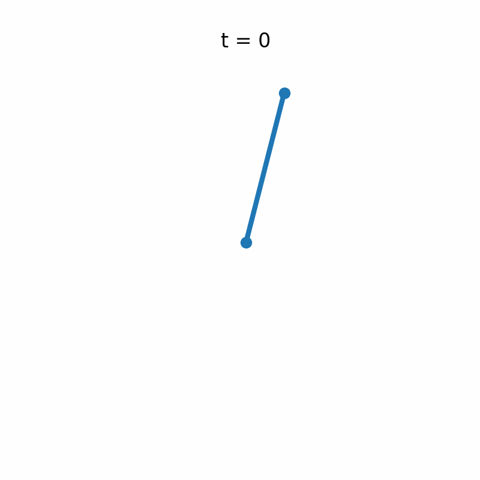
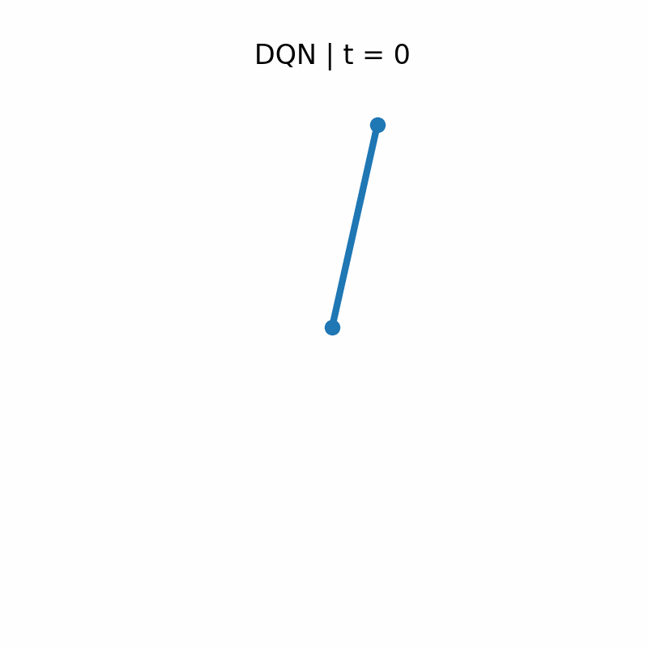
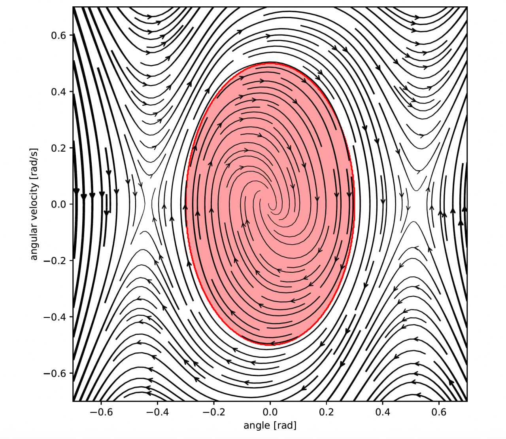
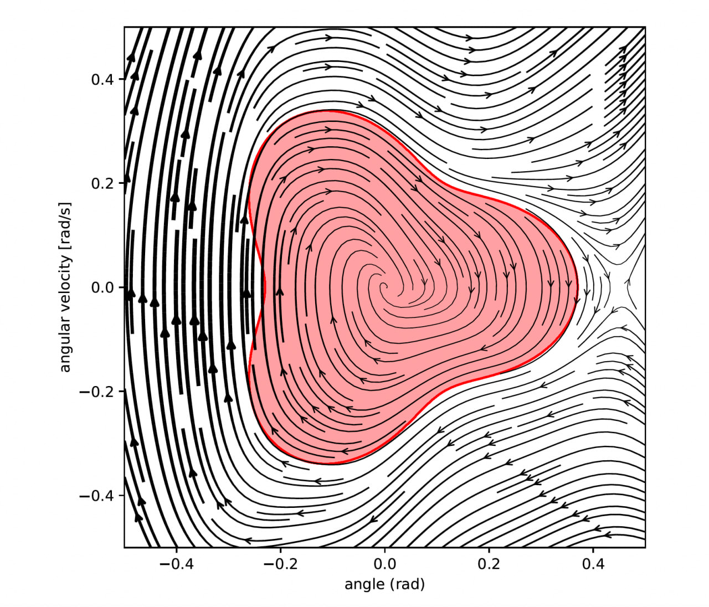
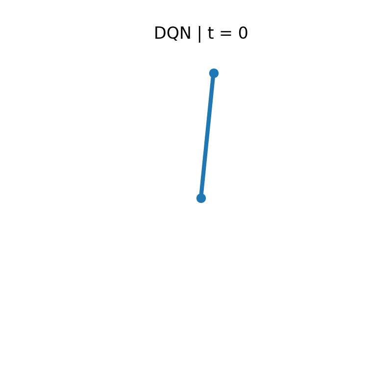
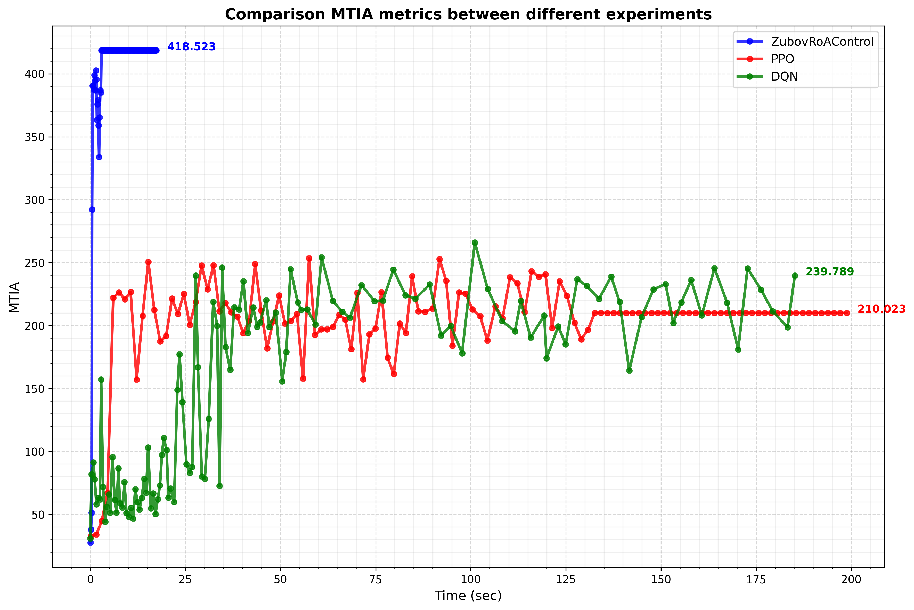
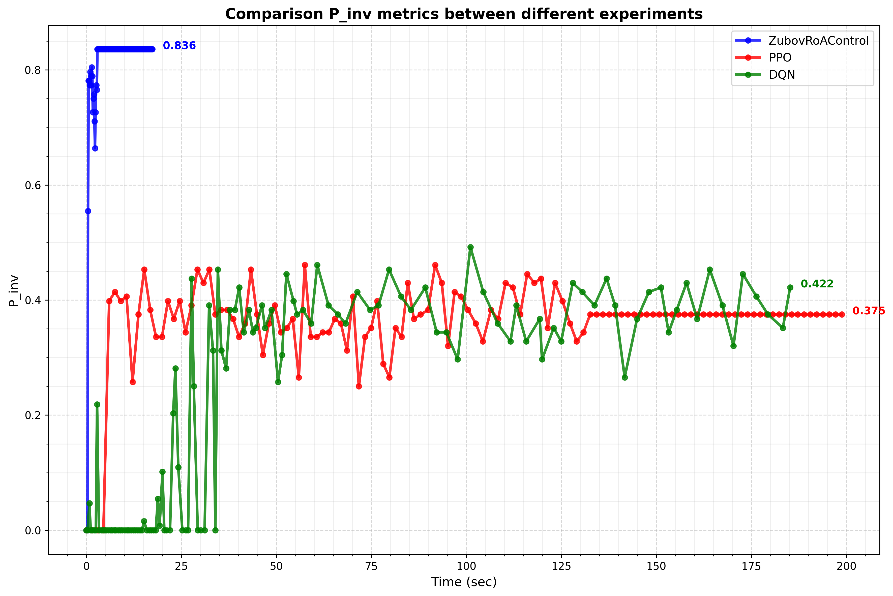

# Zubov RoA Control vs RL Baselines

In many safety-critical control problems, it is not enough to stabilize an equilibrium—one must also keep trajectories inside a prescribed safe region while converging back. Think keeping drones within attitude/rate envelopes, legged robots recovering from pushes without violating contact or joint limits, or vehicles and power systems staying within operational margins. This project implements a model-based deep-learning controller that co-learns a stabilizing feedback policy and a Zubov/Lyapunov-like certificate by minimizing the Zubov equation residual for known dynamics. We compare it against classical reinforcement learning baselines (PPO, DQN) on the inverted pendulum with user-defined safe sets and input constraints.

## Quick Preview

Zubov-based controller safely recovers, in contrast baselines do not(go out of region A):

<p float="left">
  
  
  
</p>

Target shape variations:
<p float="left">
    
    
</p>
Baselines near to stationary point

<p float="left">
  
  
</p>

Comparation of mean time in region A(MTIA) and probability that during all time from 0 to T trajectories would be in region A(P_inv):





## Project Structure

- `train.py` — model-based Zubov residual training for inverted pendulum (safe set + input constraints).
- `train_ppo.py`, `train_dqn.py` — PPO and DQN baselines.
- `animate.py`, `animate_ppo.py`, `animate_dqn.py` — rollout and GIF generation.
- `images/` — generated animations and plots (see previews above).
- `invariant_rl/` — library code for dynamics, training loops, and invariance metrics.
- `runs/` — TensorBoard logs and checkpoints (created after training).
- `ppo_policy.pt` — sample saved PPO policy.

## How to Run

Train Zubov-based controller:

```bash
python train.py
```

Train baselines:

```bash
python train_ppo.py
python train_dqn.py
```

Generate animations (uses latest checkpoints from `runs/`):

```bash
python animate.py       # ZubovRoAControl
python animate_ppo.py   # PPO
python animate_dqn.py   # DQN
```

TensorBoard logging:

```bash
tensorboard --logdir runs
```

